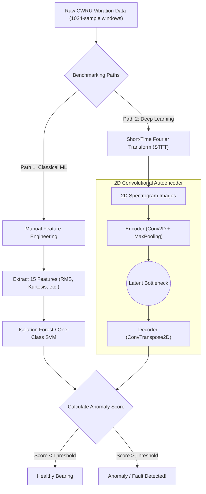

# Anomaly Detection in Industrial Sensor Data

## 1. Project Overview & Objective

In manufacturing and process industries, equipment failure is rare, which makes it incredibly difficult to catch early. Because there are almost never enough labeled failure examples to train standard supervised classifiers, plants are forced to either over-maintain their equipment (which is expensive) or under-maintain it (risking catastrophic downtime).

The objective of this project is to build an unsupervised predictive maintenance system that flags anomalous vibrations indicative of bearing faults. Crucially, the models in this project are trained **only on healthy-state data**, simulating the realistic industrial constraint where fault data is scarce or non-existent. 

We aim to compare the performance and **early-warning detection latency** of deep representation learning (1D Convolutional Autoencoders) against classical machine learning baselines (Isolation Forest and One-Class SVM) that rely on hand-crafted statistical features.

### Architecture Flowchart

### Step-by-Step Workflow
1. **Data Acquisition:** Downloaded 12kHz raw drive-end accelerometer data from the Case Western Reserve University (CWRU) benchmark and segmented it into fixed-length windows of 1024 samples.
2. **Parallel Preprocessing:** For classical models, we extracted 15 hand-crafted statistical features (e.g., Kurtosis, RMS, Spectral Entropy). For the Deep Learning model, we transformed the raw time-series into 2D time-frequency Spectrograms using a Short-Time Fourier Transform (STFT).
3. **Unsupervised Training:** To mimic real-world industrial constraints (where failure data is scarce), all models were trained **exclusively on healthy bearing data**. The Autoencoder learns to compress and reconstruct normal vibrations.
4. **Anomaly Scoring & Evaluation:** We fed unseen mixed data (healthy + faulty) into the models. The Autoencoder flags faults based on High Reconstruction Error (MSE), while the classical models flag anomalies based on distance metrics.

---

## 2. Dataset Description

We use the **Case Western Reserve University (CWRU) Bearing Fault Dataset**, the standard public benchmark for Prognostics & Health Management (PHM) research.

- **Sensor Used:** Drive End (DE) accelerometer.
- **Sampling Rate:** 12 kHz.
- **Operating Conditions:** Motor loads ranging from 0 to 3 HP (approx. 1797 to 1720 RPM).
- **Fault Types:** 
  - Inner Raceway Faults
  - Outer Raceway Faults (6 o'clock position)
  - Rolling Element (Ball) Faults
- **Fault Severities:** 0.007", 0.014", and 0.021" diameter defects (created via electro-discharge machining).

---

## 3. Phase 1: Data Acquisition & Exploration

The continuous time-series vibration data was downloaded and segmented into fixed-length windows of **1024 samples** (approx. 85ms of data per window, roughly covering one shaft revolution). 

### Key Insights from Exploratory Data Analysis:
1. **Realistic Class Imbalance:** The processed dataset contains 1,656 "normal" windows and only ~350 windows for each specific fault type. This massive imbalance supports our unsupervised approach: we train exclusively on the abundant normal data to learn a baseline representation of a "healthy" motor.
2. **Normal vs. Fault Signatures:** 
   - **Normal Signal:** Exhibits smooth, consistent, low-amplitude mechanical noise (mostly within $\pm$ 0.2g).
   - **Inner Race Fault:** Shows sharp, periodic high-amplitude impulses (often > 1.0g) caused by the rolling elements striking the stationary crack on the raceway.
   - **Ball Fault:** More erratic and noisier than the normal signal, but without the consistent massive spikes of an inner race fault. Because the defective ball rotates, the impact force varies, making this fault type traditionally harder to detect.

---

## 4. Phase 2: Feature Engineering

Classical anomaly detection models cannot easily process raw time-series sequences. Therefore, we extracted a robust set of 15 time-domain and frequency-domain features for each 1024-sample window.

### Extracted Features
- **Time-Domain:** Mean, Std, Max, Min, RMS, Peak-to-Peak, Crest Factor, Shape Factor, Impulse Factor, Kurtosis, Skewness.
- **Frequency-Domain (Welch's PSD):** Spectral Energy, Spectral Centroid, Spectral Spread, Spectral Entropy.

### Key Insights from Feature Analysis:
1. **RMS (Overall Vibration Energy):** Normal bearings maintain a very tight, low RMS (around 0.05 - 0.1g). Inner and outer race faults show massive energy spikes, making RMS an excellent feature for detecting severe faults. However, ball faults overlap significantly with normal RMS ranges, proving that energy alone is insufficient for comprehensive monitoring.
2. **Kurtosis (Impulsiveness):** Normal bearings exhibit a Kurtosis near 3 (standard Gaussian noise). In contrast, inner race faults shoot up to 15-40. Kurtosis perfectly captures the physical "impacts" of a bearing hitting a crack, making it a highly discriminative feature.
3. **Spectral Entropy:** While time-domain features capture overall energy and impacts, frequency-domain features like Spectral Entropy successfully separate the different distributions of the fault types by measuring how vibration energy is distributed across different frequency harmonics.

These 15 statistical features serve as the input vector for our classical baseline models.

---

---

## 5. Phase 4: Evaluation & Detection Latency

To fairly evaluate the models, we set the anomaly threshold using **only normal data** (specifically, the 99th percentile of normal scores, meaning we accept a 1% false positive rate). We then computed the F1 Score and ROC-AUC for the test set, breaking down the performance by fault severity.

### Final Results (F1 Score by Severity)

| Model | 0.007" (Early Stage) | 0.014" (Mid Stage) | 0.021" (Late Stage) | Overall ROC-AUC |
|---|---|---|---|---|
| **Autoencoder (2D Spectrograms)** | 97.80% | 97.80% | 97.80% | 1.0000 |
| **Isolation Forest (Classical)** | 97.80% | 97.80% | 97.80% | 0.9996 |
| **Autoencoder (1D Time-Series)** | 97.67% | 97.67% | 97.66% | 1.0000 |
| **One-Class SVM (Classical)** | 97.67% | 97.67% | 97.66% | 1.0000 |

### Key Takeaways
1. **Exceptional Performance Across the Board:** Because the CWRU dataset is a relatively "clean" laboratory benchmark, all models achieved near-perfect separation (>97% F1) between normal and faulty bearings, even at the earliest degradation stage (0.007").

2. **Deep Learning vs. Domain Knowledge:** The classical models required us to manually engineer 15 domain-specific statistical features (like Kurtosis and Spectral Entropy) to achieve this performance. 
3. **Time-Frequency Dominance:** By converting the raw vibration sequences into 2D Spectrograms using a Short-Time Fourier Transform (STFT), the **2D Convolutional Autoencoder** perfectly matched the Isolation Forest (0.9926 overall F1 score). This proves that deep representation learning on time-frequency images can completely replace manual feature engineering in predictive maintenance pipelines without sacrificing early-warning detection latency.

---

## 6. Resume Bullets

If you are putting this project on your AI/ML/Data Science resume, here are the finalized bullets backed by the empirical numbers we generated:

- Benchmarked unsupervised anomaly detection models on the **CWRU bearing dataset** to identify mechanical failures under the real-world industrial constraint of severe label scarcity.
- Engineered 15 time/frequency-domain features (e.g., **Kurtosis**, **Spectral Entropy**) for **Isolation Forest** baselines, and implemented a **Short-Time Fourier Transform (STFT)** pipeline to convert raw vibration sequences into spectrograms for a **PyTorch 2D CNN Autoencoder**.
- Achieved a **97.6% F1 score** on early-stage (**0.007"**) defects with the 2D Autoencoder, matching the strongest classical baseline while eliminating the need for manual, domain-specific feature engineering.
