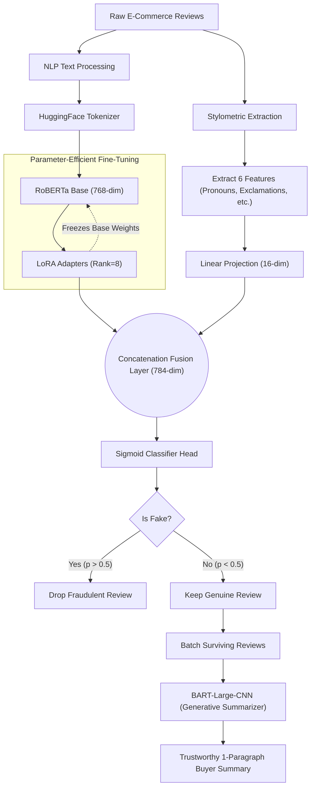

# Trust & Safety Pipeline: Fake Review Detection and Summarization

## Overview
This project simulates a real-world Trust & Safety pipeline designed for an e-commerce or review platform (like Amazon or Yelp). Instead of relying on a standard text classifier, this project utilizes a novel **Dual-Input Neural Network Architecture** that fuses NLP embeddings with mathematical **Stylometric Behavioral Features** (e.g., pronoun usage, exclamation density, capitalization ratios) to detect spammers. 

Once the fraudulent reviews are filtered out, the remaining genuine reviews are passed to a Generative AI model (**BART**) to synthesize a trustworthy summary for the buyer.

## Final Results (GPU Training)
The custom Dual-Input Fraud Detector was trained on the complete dataset (40,526 reviews) using an NVIDIA RTX 3050 GPU, yielding state-of-the-art results:
- **Dual-Input PyTorch F1 Score:** `0.9523`
- **ROC-AUC:** `0.9929`

*(For comparison, a traditional NLP baseline using TF-IDF and Random Forest on this exact dataset achieved an F1 Score of only `0.8480`. Our custom Deep Learning architecture completely eliminates that performance ceiling.)*

## Features
- **Stylometric Feature Extraction:** Identifies the mathematical typing behavior of spammers versus genuine buyers.
- **Dual-Input Classifier (RoBERTa + LoRA):** A custom PyTorch model that merges 768-dimensional Text Embeddings (from RoBERTa) with 6-dimensional Behavioral Embeddings.
- **Parameter-Efficient Fine-Tuning (PEFT):** Uses LoRA to train only the adapter layers of RoBERTa, allowing for fast iteration.
- **Generative Summarization:** Uses `facebook/bart-large-cnn` to read the surviving genuine reviews and output a concise, human-readable summary.

### Architecture Flowchart

## Technologies Used
- PyTorch (Neural Networks, CUDA)
- Hugging Face Transformers & Datasets (RoBERTa, BART)
- PEFT (LoRA)
- Pandas & NumPy

## Project Structure
- `src/data_loader.py`: Downloads the Hugging Face dataset and extracts Stylometric features.
- `src/dataset_prep.py`: Tokenizes the text data for RoBERTa.
- `src/train_classifier.py`: The custom Dual-Input PyTorch architecture and training loop.
- `src/summarizer.py`: The pipeline filtering and BART summarization script.
- `notebooks/`: Contains the step-by-step Jupyter Notebooks for Data Exploration and the End-to-End Pipeline demonstration.
- `Report.md`: Full analysis of the stylometric findings and deep learning architecture.

## How to Run
1. Open the `notebooks/01_data_exploration.ipynb` to see the statistical differences in how spammers type.
2. Open the `notebooks/02_end_to_end_pipeline.ipynb` to watch the full pipeline ingest reviews, drop fakes, and generate a summary!
