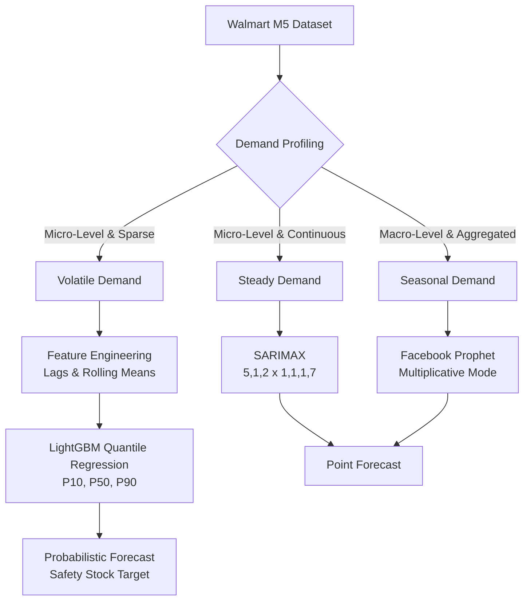

# Retail Demand Forecasting (Walmart M5)

## Overview
This project simulates a real-world enterprise supply chain forecasting system. Standard Kaggle tutorials blindly apply one massive model to all products to generate a single "Point Forecast." 

This project takes an **Operations Research (OR) approach** by doing two things differently:
1. **Demand Profiling Routing:** We cluster products into specific profiles (Steady vs Seasonal vs Volatile) and route them to specialized algorithms.
2. **Probabilistic Forecasting (Safety Stock):** Instead of just predicting the mean, we upgraded our volatile model to perform **Quantile Regression**. We generate P10, P50, and P90 prediction intervals, transforming the ML output into an actionable **Safety Stock** target for inventory management.

## The Architecture

Through iterative experimentation (V1 -> V5), we developed the following routing architecture:

1. **Steady Demand (e.g., Household Essentials)** 
   - **Model:** `SARIMAX (5,1,2)x(1,1,1,7)`
   - **Why it works:** Classical statistics perfectly capture the moving average while the seasonal order accounts for weekly dips (e.g., lower sales on Sundays).

2. **Seasonal Demand (e.g., Hobbies & Decor)**
   - **Model:** `Facebook Prophet (Multiplicative)`
   - **Why it works:** Out-of-the-box Prophet draws flat lines for intermittent data. By switching to `multiplicative` mode, the model dynamically scales its variance to capture massive seasonal bursts.

3. **Volatile/Intermittent Demand (e.g., Niche Electronics)**
   - **Model:** `LightGBM Regressor (Quantile Objective)`
   - **Why it works:** Deep LSTMs completely failed because they lacked temporal context. By engineering explicit time-series features (`lag_1`, `lag_7`, `lag_28`, `rolling_mean_7`, `day_of_week`), LightGBM perfectly predicted massive random spikes.
   - **The Probabilistic Upgrade:** By training three separate LightGBM models simultaneously with `alpha=0.10, 0.50, 0.90`, we generate a "Fan Chart". The upper bound (P90) is fed directly to the warehouse as the required **Safety Stock** to prevent stockouts during unexpected spikes.

## System Architecture Flowchart

## Step-by-Step Workflow
1. **Data Acquisition:** Load the official Walmart M5 Forecasting dataset (daily sales across CA, TX, WI).
2. **Demand Profiling:** Segment products into Steady, Seasonal, and Volatile time-series.
3. **Feature Engineering:** Generate lag features, rolling windows, and date-part features for the gradient boosting models.
4. **Model Benchmarking:** Train SARIMAX, Prophet, and LightGBM in parallel.
5. **Probabilistic Upgrading:** Train LightGBM using the quantile objective to generate confidence intervals.
6. **Evaluation:** Compare the forecasted curves against the actual holdout data.

## Execution Environment
Due to the massive size of the official dataset, this project is designed to be executed directly in a **Kaggle Notebook**.

### Files
- `notebooks/03_M5_Demand_Forecasting_V3_GodTier.ipynb`: The complete end-to-end pipeline comparing all three baseline models.
- `notebooks/05_M5_Probabilistic_Forecasting.ipynb`: The newly added Probabilistic Forecasting module that generates Safety Stock targets via Quantile Regression.

## How to Run
1. Log in to [Kaggle](https://www.kaggle.com/).
2. Navigate to the official [M5 Forecasting - Accuracy](https://www.kaggle.com/c/m5-forecasting-accuracy) dataset.
3. Click **"New Notebook"**.
4. Upload `05_M5_Probabilistic_Forecasting.ipynb` to the Kaggle environment.
5. Hit **Run All**!
