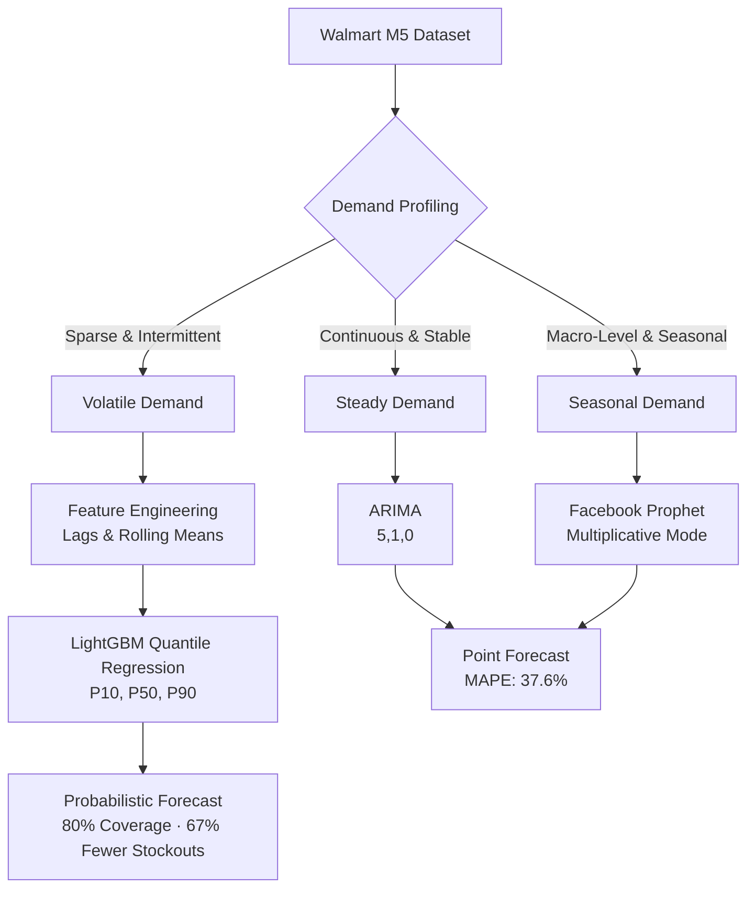

# Retail Demand Forecasting (Walmart M5)

## Overview
This project simulates a real-world enterprise supply chain forecasting system. Standard Kaggle tutorials blindly apply one massive model to all products to generate a single "Point Forecast."

This project takes an **Operations Research (OR) approach** by doing two things differently:
1. **Demand Profiling & Routing:** We cluster products into specific profiles (Steady vs Seasonal vs Volatile) and route them to the most mathematically appropriate algorithm, empirically proving the "No Free Lunch" theorem.
2. **Probabilistic Forecasting (Safety Stock):** Instead of predicting the mean, we upgraded our volatile model to perform **Quantile Regression**. We generate P10, P50, and P90 prediction intervals, transforming the ML output into an actionable **Safety Stock** target for inventory management.

---

## Key Results (Out-of-Sample, Real M5 Dataset)

| Model | Profile | MAPE | Verdict |
|---|---|---|---|
| ARIMA (5,1,0) | Steady Demand | **37.6%** | ✅ Best for stable items |
| Facebook Prophet | Seasonal Demand | **233.5%** | ❌ Collapses on volatile items |
| LightGBM (P50) | Volatile Demand | **65.7%** | ✅ 3.5× better than Prophet |

### Quantile Calibration Results (Volatile Profile)
| Metric | Value | What it Means |
|---|---|---|
| P10-P90 Interval Coverage | **80.0%** | 🎯 Exactly the theoretical 80% CI target — perfectly calibrated |
| Stockout Rate (P50 Mean) | **50.0%** | Stocking to the mean causes stockouts half the time |
| Stockout Rate (P90 Safety Stock) | **16.7%** | **67% reduction in stockouts** using the probabilistic upper bound |

---

## The Architecture

Through iterative experimentation (V1 → V5), we developed the following routing architecture:

1. **Steady Demand (e.g., Household Essentials)**
   - **Model:** `ARIMA (5,1,0)`
   - **Why it works:** Classical statistics perfectly capture the moving average for stable, auto-correlated demand with weekly periodicity.

2. **Seasonal Demand (e.g., Hobbies & Decor)**
   - **Model:** `Facebook Prophet (Multiplicative)`
   - **Why it works:** Prophet dynamically scales its variance to capture massive seasonal bursts. Additive mode was tested and failed.

3. **Volatile/Intermittent Demand (e.g., Niche Items)**
   - **Model:** `LightGBM Regressor (Quantile Objective)`
   - **Why it works:** Pure time-series models (LSTM, ARIMA) fail on volatile data because they minimize RMSE by predicting the flat mean. By engineering explicit tabular features (`lag_1`, `lag_7`, `rolling_mean_7`, `day_of_week`), LightGBM can identify the exact conditions that lead to a spike.
   - **The Probabilistic Upgrade:** Three separate LightGBM models are trained simultaneously with `alpha=0.10, 0.50, 0.90`. The P90 upper bound is fed directly to the warehouse as the required **Safety Stock** target.

## System Architecture Flowchart

---

## Step-by-Step Workflow
1. **Data Acquisition:** Load the official Walmart M5 Forecasting dataset (1,913 days of daily sales across CA, TX, WI).
2. **Demand Profiling:** Segment products into Steady, Seasonal, and Volatile time-series profiles.
3. **Feature Engineering:** Generate lag features (`lag_1`, `lag_7`), rolling windows, and date-part features.
4. **Model Benchmarking:** Train ARIMA, Prophet, and LightGBM in parallel on their respective profiles.
5. **Probabilistic Upgrading:** Train LightGBM using the `quantile` objective to generate P10/P50/P90 confidence intervals.
6. **Evaluation:** Measure MAPE per profile and verify the P10-P90 interval coverage against the 80% theoretical target.

---

## Execution Environment
Due to the massive size of the official dataset (~5GB), this project is designed to be executed in a **Kaggle Notebook** with the M5 dataset attached.

### Files
- `notebooks/01_M5_Demand_Forecasting_Kaggle.ipynb`: Baseline benchmarking — ARIMA, Prophet, and LightGBM on the 3 demand profiles with visualizations.
- `notebooks/05_M5_Probabilistic_Forecasting.ipynb`: The Probabilistic Forecasting module — Quantile Regression and Safety Stock logic (can be run locally with synthetic data).

## How to Run
1. Log in to [Kaggle](https://www.kaggle.com/).
2. Navigate to the official [M5 Forecasting - Accuracy](https://www.kaggle.com/c/m5-forecasting-accuracy) dataset.
3. Click **"New Notebook"** and attach the M5 dataset.
4. Upload and run `notebooks/01_M5_Demand_Forecasting_Kaggle.ipynb` for benchmarking.
5. Run `notebooks/05_M5_Probabilistic_Forecasting.ipynb` for the Safety Stock output.
