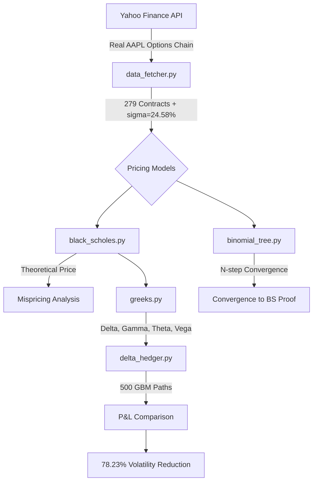

# Project 5: Options Pricing Engine (Black-Scholes, Binomial Trees & Delta-Hedging)

## Overview
This project builds a complete quantitative options pricing and risk management engine, motivated by the IE 612 Financial Engineering curriculum. Using real market data from Yahoo Finance, we implement two classical pricing models, compute the option Greeks, and simulate a Delta-Hedging strategy to prove the theory works in practice.

**The core question:** Given a stock trading at $321.66 today, what is the fair price of a contract that gives you the right to buy it at $322.50 in 7 days — and how do you protect yourself from losing money if you sell that contract?

---

## System Architecture



---

## Step-by-Step Workflow

### 1. Data Engineering (`src/data_fetcher.py`)
- Fetches the live AAPL options chain (279 liquid contracts across 3 expiry dates)
- Calculates **Historical Volatility (sigma = 24.58%)** from 1 year of daily log-returns
- Saves to `data/options_chain.csv` for offline use

### 2. Black-Scholes Pricing (`src/black_scholes.py`)
- Implements the closed-form Black-Scholes formula for European Calls and Puts
- Inputs: `S=321.66, K (per contract), T (days to expiry / 365), r=4.5%, sigma=24.58%`
- **Key Result:** Mean Absolute Pricing Error of **$2.58** vs. market price
- The ~54% relative error is expected and explainable — the market uses *implied volatility* while we use *historical volatility*. This difference is itself a major quantitative finance insight.

### 3. Binomial Tree Pricing (`src/binomial_tree.py`)
- Implements the Cox-Ross-Rubinstein (CRR) N-step Binomial Tree model
- At each node, the stock price moves Up by `u = exp(sigma * sqrt(dt))` or Down by `d = 1/u`
- Prices European and American options by backward induction
- **Key Result:** Binomial Tree price converges to Black-Scholes within **$0.01 at N=25 steps**

### 4. Greeks Calculation (`src/greeks.py`)
Computes the four key risk sensitivities for every contract in the chain:

| Greek | Formula | Value (ATM Call) | Meaning |
|---|---|---|---|
| **Delta** | N(d1) | 0.4863 | Option moves $0.49 per $1 move in AAPL |
| **Gamma** | N'(d1) / (S*sigma*sqrt(T)) | 0.0364 | Rate of change of Delta |
| **Theta** | -(S*N'(d1)*sigma)/(2*sqrt(T)) - ... | -$0.33/day | Daily time decay |
| **Vega** | S*N'(d1)*sqrt(T) | $0.18 / 1% vol | Volatility sensitivity |

### 5. Delta-Hedging Simulation (`src/delta_hedger.py`)
- **Sells 1 call option** and collects the premium upfront ($4.10)
- **UNHEDGED portfolio:** Just holds the short option position — exposed to full market risk
- **DELTA-HEDGED portfolio:** Each day, dynamically buys/sells AAPL shares to keep Delta ≈ 0
- Simulates **500 Monte Carlo price paths** using Geometric Brownian Motion (GBM)
- **Key Result: P&L Volatility Reduction of 78.23%** (Std Dev: $6.40 → $1.39)

---

## Results Summary

| Metric | Value |
|---|---|
| AAPL Spot Price | $321.66 |
| Historical Volatility (sigma) | 24.58% |
| BS Mean Absolute Pricing Error | $2.58 (54% relative) |
| Binomial Tree Convergence | N = 25 steps (within $0.01 of BS) |
| ATM Call Theta | -$0.33/day |
| **Delta-Hedging Volatility Reduction** | **78.23%** |

---

## How to Run

```bash
pip install -r requirements.txt

# Step 1: Fetch real market data
python src/data_fetcher.py

# Step 2: Run Black-Scholes mispricing analysis
python src/black_scholes.py

# Step 3: Run Binomial Tree convergence proof
python src/binomial_tree.py

# Step 4: Calculate Greeks for all contracts
python src/greeks.py

# Step 5: Run Delta-Hedging simulation
python src/delta_hedger.py
```

---

## Key References
- Capinski & Zastawniak, *Mathematics for Finance* (2003)
- Hull, *Options, Futures and Other Derivatives* (2000)
- IE 612: Introduction to Financial Engineering, IIT Bombay
