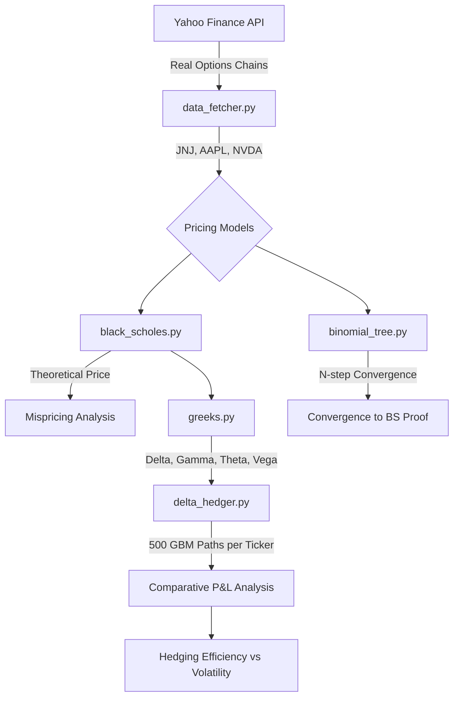

# Project 5: Options Pricing Engine (Multi-Regime Volatility Analysis)

## Overview
This project builds a quantitative options pricing and risk management engine, motivated by the IE 612 Financial Engineering curriculum. Rather than analyzing a single asset, this engine evaluates options across a **Volatility Basket** representing three distinct market regimes:
- **JNJ (Johnson & Johnson):** Low Volatility (Defensive, stable)
- **AAPL (Apple Inc.):** Medium Volatility (Mega-cap tech, liquid)
- **NVDA (NVIDIA Corp.):** High Volatility (Hyper-growth, massive price swings)

We implement Black-Scholes and Binomial Tree pricing models, compute the option Greeks, and simulate a Delta-Hedging strategy across 500 Monte Carlo paths to prove how hedging effectiveness scales with underlying risk.

---

## System Architecture



---

## Step-by-Step Workflow

### 1. Data Engineering (`src/data_fetcher.py`)
- Fetches the live options chains for JNJ, AAPL, and NVDA (624 liquid contracts total).
- Calculates **Historical Volatility (sigma)** from 1 year of daily log-returns:
  - **JNJ:** 18.1%
  - **AAPL:** 24.8%
  - **NVDA:** 35.9%

### 2. Black-Scholes Pricing (`src/black_scholes.py`)
- Implements the Black-Scholes formula and calculates mispricing (the Volatility Risk Premium).
- **Key Result:** We observe mean absolute pricing errors of ~50% across the board because the market uses implied volatility (forward-looking expectations) while we use historical volatility.

### 3. Binomial Tree Pricing (`src/binomial_tree.py`)
- Implements the Cox-Ross-Rubinstein (CRR) N-step Binomial Tree model.
- **Key Result:** Binomial Tree prices mathematically converge to the continuous-time Black-Scholes price within $0.01 at N=50 to 200 steps, proving the theoretical link between discrete and continuous finance.

### 4. Greeks Calculation (`src/greeks.py`)
Computes Delta, Gamma, Theta, and Vega. We observe that high-volatility stocks like NVDA exhibit larger Theta decay than stable stocks like JNJ.

### 5. Delta-Hedging Simulation (`src/delta_hedger.py`)
- Sells 1 At-The-Money call option for each ticker.
- **UNHEDGED:** Exposed to full market risk.
- **DELTA-HEDGED:** Dynamically buys/sells shares daily to keep Delta ≈ 0.
- Simulates **500 Monte Carlo price paths** using Geometric Brownian Motion (GBM).

---

## Final Results: Does Hedging Work Everywhere?

We found that Delta-Hedging massively reduces portfolio risk, but its efficiency decreases as stock volatility increases due to overnight "jump risk" (Gamma slippage).

| Ticker | Regime | Unhedged Risk (Std Dev) | Delta-Hedged Risk | P&L Volatility Reduction |
|---|---|---|---|---|
| **JNJ** | Low Vol (18%) | $7.65 | **$0.85** | **88.85%** |
| **AAPL** | Med Vol (25%) | $7.82 | **$1.47** | **81.25%** |
| **NVDA** | High Vol (36%) | $6.94 | **$1.32** | **80.97%** |

> **Conclusion:** The Black-Scholes Greeks are highly actionable. A market maker can use Delta to systematically eliminate >80% of directional market risk, though they must account for lower hedging efficiency in highly volatile assets.

---

## How to Run

```bash
pip install -r requirements.txt

# Run the full pipeline sequentially
python src/data_fetcher.py
python src/black_scholes.py
python src/binomial_tree.py
python src/greeks.py
python src/delta_hedger.py
```
